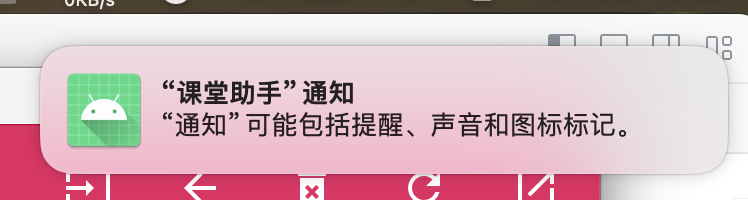

# 课堂助手 (Classmates)
A cross-platform application, designed for university classes and students.

------

# What is it?
Classmates is a helper application for a part of university students with Schedule View, Data Management and Pre class Questioning Glace.

We use Material Design(MD 2.0) style so you can enjoy it likes you do on your Android devices, and we use electron so you can use this app on Windows, macOS and Linux.

## Features
- Provide course prompts and self added notes 15 minutes before the next class.
- Display your Data folders together so that you can quickly view files or open them using the file manager(Explorer or Finder).
- Quickly locate the answer and glance at it when the teacher asks a question.

# How to install(For Users)
### Using Windows or macOS
We provided pre-complied package for Windows(x86_64) users and macOS(aarch64) users. If you are using a Windows PC with Intel or AMD CPU, or a Mac with Apple Silicon, you can go Release page and find the package which is suitable for your device.

### Using Linux
We are sorry as we did not provide a pre-complied package for Linux. So if you want to install and use this application, you should clone or download the sources and follow the following steps to build your own package.

# Rehabilitative Measures
At this point, we assume that you have already installed this application and can enter the homepage normally and see our preset data.
1. Enter the settings page of your OS and enable notification permissions for this application in the notification settings. (Here we take macOS as an example)

Or

2. Minimize or place the application in the background when not in use. Closing it will result in inability to notify.

# How to install(For Developers)
- Download or clone the sources to your device.(If you find this project interesting, you can fork it but follow GPL2.0 is the only required.)
- Use `npm` or `cnpm` as package management, run `cnpm i` first to install modules this project requires.
- Run `cnpm run electron:build-icons` to generate application icons.
- Configurate package.json by following electron-builder's guide to add Linux pack or other arch pack.
- Run `cnpm run start` to test it.

# Contribution
This project was hastily written by us during the National Day holiday, and there will inevitably be many bugs. If you discover any bugs or deficiencies in the application, or want to provide some suggestions for further development of the application, please feel free to initiate an Issue in Simplified Chinese as the text in this repository at any time.

Based on privacy considerations, Github Issues is the only way for you to communicate with us.

------

Have fun with it.
Follow the GPL2.0 license and use it.